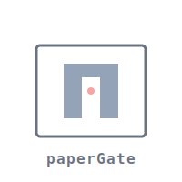
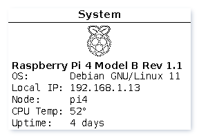

<p align="center">
  
</p>

# paperGate

Raspberry Pi gateway with e-Paper display for home network monitoring and control.



## Features

- 📟 **E-Paper Display**: WaveShare 2.7" e-Paper HAT showing system stats, weather, calendar, and more
- 🌐 **Web Interface**: Control your display remotely from any browser
- 📰 **RSS Feed Reader**: E-paper optimized news feed viewer (integrated in web interface)
- 🔐 **Tailscale Gateway**: Monitor VPN status and connected peers
- 📊 **System Dashboard**: Visual monitoring with CPU, memory, temperature, disk usage
- 📅 **Calendar Integration**: CalDAV/webcal support with event times and all-day detection
- 🌦️ **Weather**: Met.no provider with 42 conditions and 60+ professional SVG icons
- 🎲 **Fortune Cookies**: Random quotes and affirmations

## Quick Start

### Prerequisites

- Raspberry Pi (tested on Pi 4)
- WaveShare 2.7in e-Paper HAT (V2)
- Raspberry Pi OS (Bookworm or later)
- SPI interface enabled (`sudo raspi-config` → Interface Options → SPI)

### Installation

```bash
# Clone the repository
git clone https://github.com/yourusername/paperGate.git
cd paperGate

# Run installation script
sudo ./scripts/install.sh

# Setup command aliases (optional but recommended)
./scripts/setup-aliases.sh

# Edit configuration
nano local_settings.py

# Start services using aliases
pg-start

# Or without aliases
sudo systemctl start papergate papergate-web

# Enable auto-start on boot
pg-enable  # or: sudo systemctl enable papergate papergate-web
```

Access the web interface at: `http://your-pi-ip:5000`

## Configuration

All configuration is managed in a single file: `local_settings.py`

### Configuration File

Edit `local_settings.py`:

```python
# Display driver
DRIVER = "epd2in7b_V2"

# Screens to show (in order)
SCREENS = [
    'system',
    'tailscale',
    'system_dashboard',
    'weather',
    'calendar',
    'webview',  # Shows RSS feed from web interface
]

# Weather - Met.no provider (Norwegian Meteorological Institute)
WEATHER_LATITUDE = 45.4642   # Your location coordinates
WEATHER_LONGITUDE = 9.1900
WEATHER_CITY_NAME = "Milano"  # City name to display
WEATHER_CONTACT_EMAIL = "your.email@example.com"  # Required by Met.no Terms of Service
WEATHER_REFRESH = 900  # Update interval in seconds (15 min)

# Calendar (webcal or CalDAV)
CALENDAR_URLS = [
    {'type': 'webcal', 'url': 'https://calendar.google.com/...'},
]

# RSS Feed (displayed via webview screen)
WEBVIEW_URL = 'http://localhost:5000/feed'
WEBVIEW_SCALE = 0.8

# Web Interface Authentication (IMPORTANT: Change these!)
AUTH_USERNAME = 'admin'
AUTH_PASSWORD = 'your-secure-password'

# Flask secret key (generate with: python3 -c 'import os; print(os.urandom(16))')
SECRET_KEY = b'your-secret-key-here'

# RSS Feed Sources
FEEDS = [
    'https://www.ansa.it/sito/ansait_rss.xml',  # ANSA Italia
    'http://feeds.bbci.co.uk/news/rss.xml',     # BBC News
    # Add more feeds here
]
```

## Available Screens

- **system**: Raspberry Pi model, OS, IP, temperature, uptime
- **tailscale**: VPN status, IPs, exit node, connected peers
- **system_dashboard**: Visual CPU/memory/temp/disk dashboard with pie charts
- **weather**: Current weather from Met.no with SVG icons (42 conditions, day/night distinction)
- **calendar**: Upcoming calendar events with start-end times (auto-hides times for all-day events)
- **tasks**: Todo list from CalDAV
- **dashboard**: Combined info view with auto-refresh (time, weather, calendar)
- **fortune**: Random fortune cookies
- **affirmations**: Positive affirmations
- **webview**: Display webpages (shows RSS feed by default)

## Command Aliases

After running `setup-aliases.sh`, these aliases are available:

```bash
pg          # Run paperGate core daemon directly (for testing)
pg-start    # Start both papergate services
pg-stop     # Stop both papergate services
pg-restart  # Restart both papergate services
pg-enable   # Enable auto-start on boot
pg-disable  # Disable auto-start on boot
pg-status   # Show status of both services
pg-log      # Follow papergate core logs
pg-web-log  # Follow papergate web logs
pg-logs     # Follow both logs together
```

The setup script automatically adds sourcing of `.bash_aliases` to your `.bashrc` or `.zshrc` if not already present.

## CLI Control

Using `core/cli.py` directly:

```bash
cd ~/paperGate/core

# Reload current screen
./cli.py reload

# Switch screens
./cli.py screen weather

# Navigate
./cli.py next
./cli.py previous

# Manage screens (session-only)
./cli.py add_screen fortune
./cli.py remove_screen affirmations
```

## Architecture

```
paperGate/
├── core/           # Main e-paper display daemon
│   ├── app.py      # Core application
│   ├── screens/    # Screen modules
│   ├── libs/       # Supporting libraries
│   │   ├── weather_providers/  # Weather provider modules (Met.no, OpenWeatherMap, etc.)
│   │   ├── calendar_events.py  # Calendar integration
│   │   ├── metno_adapter.py    # Met.no weather adapter
│   │   └── weather_utility.py  # Weather API caching
│   └── display/    # Runtime screenshots (gitignored)
├── web/            # Flask web interface (includes RSS feed reader)
│   ├── app.py      # Web app + /feed endpoint
│   └── templates/  # HTML templates
├── icons/          # Weather SVG icons (60+ professional icons)
├── cache/          # Runtime temporary files (gitignored)
├── images/         # Shared assets (logos, fallback PNG icons)
├── systemd/        # Service definitions (2 services)
└── scripts/        # Installation automation
```

**Communication**: Both CLI and web interface communicate with the core daemon via POSIX message queue (`/epdtext_ipc`).

**Services**:
- `papergate.service` - Core e-paper display daemon
- `papergate-web.service` - Web interface + RSS feed reader (single Flask app on port 5000)

## Troubleshooting

### Display not updating
- Check SPI is enabled: `ls /dev/spi*`
- Check service is running: `pg-status`
- Check logs: `pg-log`

### Web interface not accessible
- Verify service is running: `sudo systemctl status papergate-web`
- Check firewall: `sudo ufw allow 5000`
- Test locally: `curl http://localhost:5000`

### Permission errors on message queue
- Ensure papergate service is running first (creates the queue)
- Check queue permissions: `ls -la /dev/mqueue/epdtext_ipc`

## Creating Custom Screens

See `docs/DEVELOPMENT.md` for detailed screen development guide.

Basic example:

```python
# core/screens/myscreen.py
from screens import AbstractScreen

class Screen(AbstractScreen):
    def reload(self):
        self.blank()
        self.draw_titlebar("My Screen")
        self.text("Hello World", font_size=40, position=(50, 50))
```

Add `'myscreen'` to the `SCREENS` list in `local_settings.py`.

## Documentation

- [Installation Guide](docs/INSTALLATION.md)
- [Configuration Guide](docs/CONFIGURATION.md)
- [Available Screens](docs/SCREENS.md)
- [Development Guide](docs/DEVELOPMENT.md)
- [Troubleshooting](docs/TROUBLESHOOTING.md)

## Contributing

Contributions welcome! Please read [docs/DEVELOPMENT.md](docs/DEVELOPMENT.md) first.

## License

MIT License - see [LICENSE](LICENSE)

## Weather System

paperGate uses **Met.no** (Norwegian Meteorological Institute) for weather data:

### Features
- 🌍 **42 weather conditions** (vs 18 with previous provider) - better granularity
- 🎨 **60+ professional SVG icons** - sharp, scalable vector graphics
- 🌓 **Day/night distinction** - different icons for daytime vs nighttime
- 🆓 **Free, no API key** - reliable Norwegian Met Institute service
- 📍 **Coordinate-based** - works anywhere in the world

### Configuration

Weather is configured in `local_settings.py`:

```python
WEATHER_LATITUDE = 45.4642    # Your coordinates
WEATHER_LONGITUDE = 9.1900
WEATHER_CITY_NAME = "Milano"
WEATHER_CONTACT_EMAIL = "your.email@example.com"  # Required by Met.no ToS
WEATHER_REFRESH = 900  # Update every 15 minutes
```

**Important**: Met.no Terms of Service require providing a contact email in the User-Agent. This is used only if they need to contact you about API usage issues.

### Display Layouts

**Dashboard Screen** (auto-refreshes every minute):
- Large weather icon (50px) centered in left section
- Bold temperature display (high°/low°)
- Weather description below
- Compact spacing optimized for e-paper

**Weather Screen**:
- Extra large icon (85px) on left
- Bold temperature (40px) right-aligned
- Description and city name centered below

### Icon Examples

Met.no provides detailed conditions:
- `clear_sky_day.svg` / `clearnight.svg` - Clear skies (day/night)
- `rain_heavy.svg` / `rain_light.svg` - Rain intensity levels
- `snow_heavy.svg` / `snow_light.svg` - Snow intensity levels
- `mostly_cloudy.svg` / `partly_cloudy_day.svg` - Cloud coverage
- And 50+ more...

Icons are rendered from SVG to 1-bit PNG for optimal e-paper display.

## Acknowledgments

- Original epdtext project by [tsbarnes](https://github.com/tsbarnes/epdtext)
- WaveShare for e-Paper drivers and weather icons
- Met.no (Norwegian Meteorological Institute) for weather API
- Python community for amazing libraries

## Support

- 📖 [Full Documentation](docs/)
- 🐛 [Issue Tracker](https://github.com/yourusername/paperGate/issues)
- 💬 [Discussions](https://github.com/yourusername/paperGate/discussions)
